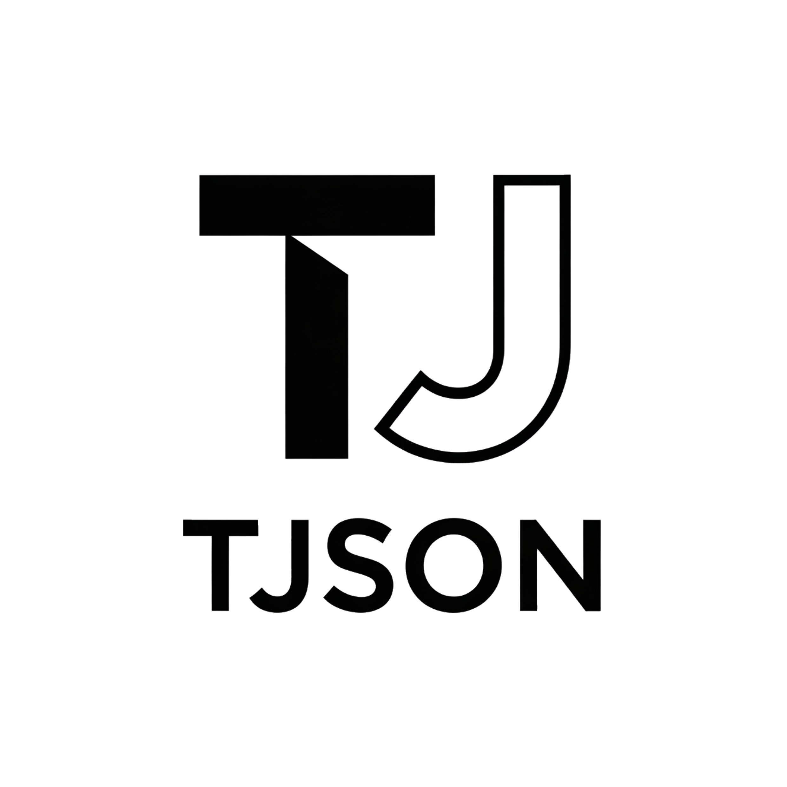

# 🚀 TJson Portfolio



A modern, elegant, and responsive portfolio website showcasing my work as a Senior Full Stack Developer.

[](https://tjson.com)
[](https://github.com/jason7337/Jasson-s-Portfolio-TJson-)

## ✨ Features

- **🌐 Multilingual Support** - Spanish and English
- **🎨 Modern Design** - Clean, elegant UI with smooth animations
- **📱 Fully Responsive** - Optimized for all devices
- **⚡ High Performance** - Built with Vite for lightning-fast loading
- **🎭 Framer Motion** - Beautiful animations and transitions
- **🌙 Dark/Light Mode** - Adaptive theme support
- **📧 Contact Form** - EmailJS integration for direct messaging
- **🔍 SEO Optimized** - Complete meta tags and structured data
- **♿ Accessible** - WCAG compliant design

## 🛠️ Tech Stack

### Frontend
- **React 18** - Modern React with hooks and functional components
- **TypeScript** - Type-safe development
- **Vite** - Next-generation frontend tooling
- **Tailwind CSS** - Utility-first CSS framework
- **Framer Motion** - Production-ready motion library

### Development Tools
- **ESLint** - Code linting and formatting
- **PostCSS** - CSS processing
- **i18next** - Internationalization framework
- **EmailJS** - Email service integration
- **Lucide React** - Beautiful icon library

### Deployment
- **Vercel/Netlify Ready** - Optimized for modern hosting platforms
- **GitHub Pages** - Alternative deployment option

## 🚀 Quick Start

### Prerequisites
- Node.js 18+ 
- npm or yarn

### Installation

1. **Clone the repository**
```bash
git clone https://github.com/jason7337/Jasson-s-Portfolio-TJson-.git
cd Jasson-s-Portfolio-TJson-
```

2. **Install dependencies**
```bash
npm install
```

3. **Start development server**
```bash
npm run dev
```

4. **Open in browser**
Navigate to `http://localhost:5173`

### Build for Production
```bash
npm run build
npm run preview
```

## 📁 Project Structure

```
client/
├── public/
│   └── images/           # Profile photos and logos
├── src/
│   ├── components/       # React components
│   │   ├── About.tsx
│   │   ├── Contact.tsx
│   │   ├── Experience.tsx
│   │   ├── Hero.tsx
│   │   ├── Navbar.tsx
│   │   ├── Projects.tsx
│   │   └── Skills.tsx
│   ├── config/
│   │   └── colors.ts     # Color palette configuration
│   ├── i18n/
│   │   ├── index.ts      # i18n configuration
│   │   └── translations.ts # Translation files
│   ├── App.tsx           # Main application component
│   └── main.tsx          # Application entry point
├── index.html            # HTML template
└── package.json          # Dependencies and scripts
```

## 🌍 Internationalization

The portfolio supports both Spanish and English:

- **Default Language**: Spanish (ES)
- **Alternative Language**: English (EN)
- **Translation Files**: `src/i18n/translations.ts`
- **Language Switcher**: Available in the navigation bar

To add a new language:
1. Add translations to `src/i18n/translations.ts`
2. Update the language switcher in `Navbar.tsx`
3. Add the new locale to `src/i18n/index.ts`

## 🎨 Customization

### Color Palette
The design system uses a carefully crafted color palette defined in `src/config/colors.ts`:

- **Primary**: Blue tones (#0ea5e9)
- **Accent**: Purple tones (#a855f7)
- **Neutral**: Gray scale for text and backgrounds
- **Semantic**: Success, warning, error colors

### Content Updates
- **Personal Information**: Update `src/i18n/translations.ts`
- **Skills**: Modify the skills array in `Skills.tsx`
- **Projects**: Update the projects array in `Projects.tsx`
- **Images**: Replace files in `public/images/`

## 📧 Contact Form Setup

The contact form uses EmailJS for sending emails:

1. **Create EmailJS Account**: [https://emailjs.com](https://emailjs.com)
2. **Get Service ID, Template ID, and Public Key**
3. **Update Contact.tsx**:
```typescript
emailjs.init('YOUR_PUBLIC_KEY');
await emailjs.send('YOUR_SERVICE_ID', 'YOUR_TEMPLATE_ID', templateParams);
```

## 🚀 Deployment

### Vercel (Recommended)
1. Push code to GitHub
2. Connect repository to Vercel
3. Deploy automatically

### Netlify
1. Build the project: `npm run build`
2. Deploy the `dist` folder to Netlify

### GitHub Pages
1. Install gh-pages: `npm install --save-dev gh-pages`
2. Add deploy script to package.json:
```json
"deploy": "gh-pages -d dist"
```
3. Run: `npm run build && npm run deploy`

## 📊 Performance

- **Lighthouse Score**: 90+ (Performance, Accessibility, Best Practices, SEO)
- **Core Web Vitals**: Optimized for excellent user experience
- **Bundle Size**: Optimized with code splitting and tree shaking
- **Image Optimization**: WebP format with fallbacks

## 🤝 Contributing

1. Fork the repository
2. Create your feature branch: `git checkout -b feature/new-feature`
3. Commit your changes: `git commit -am 'Add new feature'`
4. Push to the branch: `git push origin feature/new-feature`
5. Submit a pull request

## 📄 License

This project is licensed under the MIT License - see the [LICENSE](LICENSE) file for details.

## 👨‍💻 About Me

**Jasson Armando Gómez Guevara**  
Senior Full Stack Developer | Python & JavaScript Specialist

- 🌍 **Location**: El Salvador
- 💼 **Remote Work**: 100% Available
- 📧 **Email**: [gomezjason010@gmail.com](mailto:gomezjason010@gmail.com)
- 📱 **Phone**: +503 7502 5302
- 🚀 **Company**: Founder of [SpeedyGoApp](https://speedygoapp.com)

### Tech Stack Expertise
- **Backend**: Python (Flask, FastAPI, Django), Node.js (Express, Nest.js), Java
- **Frontend**: React.js, TypeScript, Angular, Vue.js, Next.js
- **Databases**: PostgreSQL, MongoDB, MySQL, Oracle
- **Cloud & DevOps**: AWS, Docker, Kubernetes, CI/CD
- **Mobile**: React Native, Electron, Tauri

## 🌟 Support

If you like this project, please give it a ⭐ on GitHub!

---

**Made with ❤️ using React + TypeScript + Framer Motion**

*This portfolio demonstrates my expertise in modern web development technologies and serves as a showcase of my professional work and skills.*